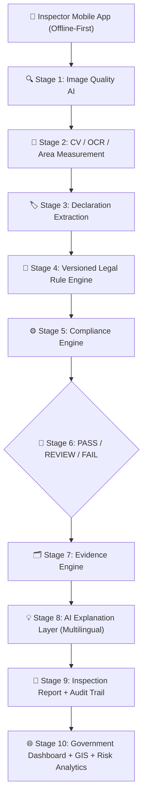

# ⚖️ Niyam Dristi

> **AI-Powered Offline-First Legal Metrology Inspection & Compliance Intelligence Platform**  
> **Problem Statement ID:** SIH26034 | Smart India Hackathon

---

## 📌 Executive Summary

**Niyam Dristi** is an enterprise-grade, offline-first compliance inspection ecosystem designed for Legal Metrology officers across India. It streamlines enforcement of the **Legal Metrology (Packaged Commodities) Rules, 2011** (and subsequent amendments) by transforming manual label scrutiny into an automated, AI-assisted verification pipeline with verifiable cryptographic evidence.

The platform empowers field inspectors to operate in zero-connectivity environments with local SQLite/WatermelonDB persistence, on-device image quality validation, and automated extraction of mandatory declarations, while synchronizing seamlessly to a centralized government dashboard with GIS risk analytics.

---

## 🏛️ End-to-End Architecture Pipeline

The system processes packaging labels through a 10-stage intelligent compliance pipeline:



### Detailed Pipeline Flow

1. **Inspector Mobile PWA / App**:
   - Field officer initiates inspection with shop metadata, GPS coordinates, and offline caching.
2. **Image Quality AI**:
   - Evaluates lighting, blur, glare, and skew angle in real time to guarantee legible OCR and precise physical dimensional measurement.
3. **CV / OCR / Measurement**:
   - Segments the Principal Display Area (PDA) and measures character heights against physical label bounds using reference scale calibration.
4. **Declaration Extraction**:
   - Normalizes mandatory fields: Product Name, Manufacturer/Packer/Importer, Country of Origin, Net Quantity, MRP, Unit Sale Price, Dates (Mfg/Expiry), and Consumer Care details.
5. **Versioned Legal Rule Engine**:
   - Applies date-versioned statutory rules from the Legal Metrology Act and Packaged Commodities Rules 2011 to evaluate commodity-specific mandates.
6. **Compliance Engine**:
   - Compares extracted declarations and measurements against legal thresholds (e.g. font height rules, standard unit declarations, unit sale price formatting).
7. **PASS / REVIEW / FAIL Decision Matrix**:
   - Generates confidence scores and flags discrepancies with categorized severity (Low, Medium, High, Critical).
8. **Evidence Engine**:
   - Captures bounding-box crop overlays, highlighted violation regions, and immutable metadata.
9. **AI Explanation Layer**:
   - Generates plain-language legal citations and actionable guidance in English and regional Indian languages.
10. **Inspection Report + Audit Trail**:
    - Creates tamper-evident inspection records signed by the officer with tamper-resistant audit logs.
11. **Government Dashboard + GIS + Risk Analytics**:
    - Centralized web portal providing GIS heatmaps, repeat offender tracking, commodity risk profiling, and automated summons/notice dispatch.

---

## 🗂️ Monorepo Structure

```text
/nyayalabel-ai
├── /mobile        -> React Native (Expo, TypeScript) officer-facing offline-first app
├── /backend       -> Node.js + Express + TypeScript REST API & sync engine
├── /web           -> React + Vite + TypeScript + Tailwind CSS admin/reviewer dashboard
├── /shared        -> Shared TypeScript types (Inspection, Product, Violation, Rule, Officer, etc.)
├── /docs          -> Architecture notes, rule engine specifications, offline sync design
├── docker-compose.yml -> Stub for backend REST API + MongoDB persistence
├── package.json   -> Root monorepo workspace configuration
└── README.md      -> Architecture documentation and developer guide
```


# 🧩 Prototype vs. Proposed Production Stack

The technologies below are intentionally divided into **what is used in the current prototype** and **what is planned for the complete production implementation**.

This distinction ensures that the GitHub repository accurately represents the working prototype while the proposed architecture represents the technologies planned for full-scale execution.

## 📱 Mobile Application

| Component         | Current Prototype                  | Proposed Production System         |
| ----------------- | ---------------------------------- | ---------------------------------- |
| Framework         | React Native + Expo + TypeScript   | React Native + Expo + TypeScript   |
| Navigation        | React Navigation                   | React Navigation                   |
| Offline Storage   | Expo SQLite                        | Expo SQLite                        |
| Secure Storage    | Expo SecureStore                   | Expo SecureStore                   |
| Device APIs       | Expo Camera, Location, File System | Expo Camera, Location, File System |
| Network Detection | React Native NetInfo               | React Native NetInfo               |

## 🌐 Web Dashboard

| Component  | Current Prototype         | Proposed Production System           |
| ---------- | ------------------------- | ------------------------------------ |
| Framework  | React + Vite + TypeScript | React + Vite + TypeScript            |
| Styling    | Tailwind CSS              | Tailwind CSS                         |
| Routing    | React Router              | React Router                         |
| Maps       | Leaflet + React-Leaflet   | Mapbox GL JS                         |
| Analytics  | Dashboard visualizations  | Apache ECharts + MongoDB Aggregation |
| Deployment | Vercel                    | Vercel                               |

## ⚙️ Backend & Database

| Component         | Current Prototype              | Proposed Production System     |
| ----------------- | ------------------------------ | ------------------------------ |
| Backend           | Node.js + Express + TypeScript | Node.js + Express + TypeScript |
| Database          | MongoDB Atlas + Mongoose       | MongoDB Atlas + Mongoose       |
| Validation        | Zod                            | Zod + OpenAPI/Swagger          |
| Authentication    | JWT                            | JWT + Refresh Tokens + RBAC    |
| Password Security | Bcrypt                         | Argon2id                       |
| File Handling     | Multer                         | Multer + Cloud Storage         |
| API Documentation | Swagger UI                     | OpenAPI / Swagger              |

## 👁️ OCR & AI

| Component       | Current Prototype                    | Proposed Production System               |
| --------------- | ------------------------------------ | ---------------------------------------- |
| OCR             | Gemini API + OCR.space / ML Kit      | Google Document AI + Google Cloud Vision |
| AI              | Gemini Multimodal API                | Multimodal LLM/API                       |
| Legal Knowledge | Rule/data-based implementation       | MongoDB Atlas Vector Search + RAG        |
| Compliance      | Deterministic TypeScript Rule Engine | Deterministic TypeScript Rule Engine     |

## 📐 Computer Vision

| Component        | Current Prototype                        | Proposed Production System |
| ---------------- | ---------------------------------------- | -------------------------- |
| Image Processing | Expo Image Manipulator / JPEG processing | OpenCV + preprocessing     |
| Measurement      | Prototype implementation                 | OpenCV + ArUco             |
| Barcode          | ML Kit / barcode scanner                 | ML Kit / barcode scanner   |

## ☁️ Infrastructure & Advanced Services

| Component           | Proposed Production Technology                   |
| ------------------- | ------------------------------------------------ |
| Cloud Storage       | Google Cloud Storage                             |
| Background Jobs     | Redis + BullMQ                                   |
| GIS                 | Mapbox GL JS                                     |
| Analytics           | MongoDB Aggregation + Apache ECharts             |
| Risk Analysis       | Custom Risk Scoring Engine                       |
| PDF Reports         | Puppeteer                                        |
| Report Verification | QR Code + SHA-256                                |
| Security            | HTTPS + Helmet + Rate Limiting + Secrets Manager |
| Monitoring          | Sentry + Pino + Cloud Monitoring                 |
| Testing             | Vitest/Jest + Supertest + Playwright             |
| Backend Deployment  | Google Cloud Run                                 |
| CI/CD               | GitHub Actions                                   |
| Mobile Deployment   | Expo EAS                                         |

---

# 🏗️ System Architecture

### Current Prototype

```text
┌─────────────────────┐
│   Inspector Mobile  │
│ React Native + Expo │
└──────────┬──────────┘
           │
           ▼
┌─────────────────────┐
│      Backend        │
│ Node.js + Express   │
└───────┬───────┬─────┘
        │       │
        ▼       ▼
   MongoDB     OCR / AI
    Atlas
        │
        ▼
┌─────────────────────┐
│    Web Dashboard    │
│ React + Vite + TS   │
└─────────────────────┘
```

### Proposed Production Architecture

```text
                 ┌──────────────────────┐
                 │    Inspector App     │
                 │ React Native + Expo  │
                 └──────────┬───────────┘
                            │
                            ▼
                 ┌──────────────────────┐
                 │      REST API        │
                 │ Node + Express + TS  │
                 └──────────┬───────────┘
                            │
          ┌─────────────────┼─────────────────┐
          ▼                 ▼                 ▼
     OCR / AI          Rule Engine        RAG / Legal
          │                 │                 │
          └─────────────────┼─────────────────┘
                            ▼
                 ┌──────────────────────┐
                 │    MongoDB Atlas     │
                 │ Data + Rules + RAG   │
                 └──────────┬───────────┘
                            │
              ┌─────────────┼─────────────┐
              ▼             ▼             ▼
           Analytics       GIS          Reports
              │             │             │
              └─────────────┼─────────────┘
                            ▼
                 ┌──────────────────────┐
                 │    Web Dashboard     │
                 └──────────────────────┘
```


---

# 🛠️ Running the Prototype

### Clone the repository

```bash
git clone <repository-url>
cd parakrami_sih
```

### Install dependencies

```bash
npm install
```

The project uses **npm workspaces** to manage the monorepo.

Run the required applications using the commands defined in their respective workspace `package.json` files.

---

# 🌐 Demo

### Web Application

**Live Demo:**
`<parakrami-7kp40yejr-parakrami.vercel.app>`

### Mobile Application

**APK:**
`<https://github.com/J-Gunjan/parakrami_sih/releases/download/v1.0.0/application-27ddee23-1c4d-437b-9fa4-dcd78b44b665.apk>`

The prototype demonstrates the core inspection workflow from product capture and OCR through compliance evaluation and dashboard visualization.

---

# 📌 Project Status

**Niyam Drishti is currently a working prototype developed for Smart India Hackathon (SIH).**

The current prototype focuses on demonstrating the core functionality and user experience.

The **Proposed Production Stack** represents the planned technical architecture for transforming the prototype into a scalable, secure, and deployment-ready Legal Metrology inspection platform.

---

# 🔮 Future Implementation

The production version will progressively introduce:

* Higher-accuracy structured OCR
* Advanced computer vision and measurement
* Vector-search-based legal knowledge retrieval
* RAG-powered legal explanations
* Scalable background processing
* Advanced GIS and hotspot analytics
* Risk-based inspection prioritization
* Secure cloud infrastructure
* Automated report generation and verification
* Production monitoring and CI/CD

---

## 🎯 Vision

> **Inspect Smarter. Enforce Better.**


## 📜 Statutory Reference

Built for enforcement of:

- **The Legal Metrology Act, 2009** (Act No. 1 of 2010)
- **The Legal Metrology (Packaged Commodities) Rules, 2011** (GSR 202(E) and subsequent amendments)
- Department of Consumer Affairs, Ministry of Consumer Affairs, Food & Public Distribution, Government of India.
