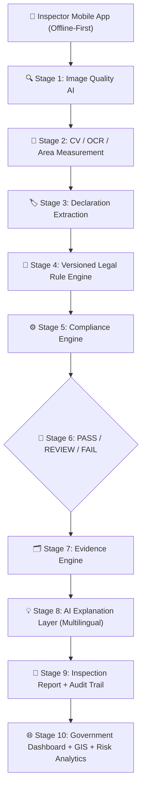

# ⚖️ NyayaLabel AI

> **AI-Powered Offline-First Legal Metrology Inspection & Compliance Intelligence Platform**  
> **Problem Statement ID:** SIH26034 | Smart India Hackathon

---

## 📌 Executive Summary

**NyayaLabel AI** is an enterprise-grade, offline-first compliance inspection ecosystem designed for Legal Metrology officers across India. It streamlines enforcement of the **Legal Metrology (Packaged Commodities) Rules, 2011** (and subsequent amendments) by transforming manual label scrutiny into an automated, AI-assisted verification pipeline with verifiable cryptographic evidence.

The platform empowers field inspectors to operate in zero-connectivity environments with local SQLite/WatermelonDB persistence, on-device image quality validation, and automated extraction of mandatory declarations, while synchronizing seamlessly to a centralized government dashboard with GIS risk analytics.

---

## 🏛️ End-to-End Architecture Pipeline

The system processes packaging labels through a 10-stage intelligent compliance pipeline:



### Detailed Pipeline Flow

1. **Inspector Mobile PWA / App**:
   - Field officer initiates inspection with shop metadata, GPS coordinates, and offline caching.
2. **Image Quality AI**:
   - Evaluates lighting, blur, glare, and skew angle in real time to guarantee legible OCR and precise physical dimensional measurement.
3. **CV / OCR / Measurement**:
   - Segments the Principal Display Area (PDA) and measures character heights against physical label bounds using reference scale calibration.
4. **Declaration Extraction**:
   - Normalizes mandatory fields: Product Name, Manufacturer/Packer/Importer, Country of Origin, Net Quantity, MRP, Unit Sale Price, Dates (Mfg/Expiry), and Consumer Care details.
5. **Versioned Legal Rule Engine**:
   - Applies date-versioned statutory rules from the Legal Metrology Act and Packaged Commodities Rules 2011 to evaluate commodity-specific mandates.
6. **Compliance Engine**:
   - Compares extracted declarations and measurements against legal thresholds (e.g. font height rules, standard unit declarations, unit sale price formatting).
7. **PASS / REVIEW / FAIL Decision Matrix**:
   - Generates confidence scores and flags discrepancies with categorized severity (Low, Medium, High, Critical).
8. **Evidence Engine**:
   - Captures bounding-box crop overlays, highlighted violation regions, and immutable metadata.
9. **AI Explanation Layer**:
   - Generates plain-language legal citations and actionable guidance in English and regional Indian languages.
10. **Inspection Report + Audit Trail**:
    - Creates tamper-evident inspection records signed by the officer with tamper-resistant audit logs.
11. **Government Dashboard + GIS + Risk Analytics**:
    - Centralized web portal providing GIS heatmaps, repeat offender tracking, commodity risk profiling, and automated summons/notice dispatch.

---

## 🗂️ Monorepo Structure

```text
/nyayalabel-ai
├── /mobile        -> React Native (Expo, TypeScript) officer-facing offline-first app
├── /backend       -> Node.js + Express + TypeScript REST API & sync engine
├── /web           -> React + Vite + TypeScript + Tailwind CSS admin/reviewer dashboard
├── /shared        -> Shared TypeScript types (Inspection, Product, Violation, Rule, Officer, etc.)
├── /docs          -> Architecture notes, rule engine specifications, offline sync design
├── docker-compose.yml -> Stub for backend REST API + MongoDB persistence
├── package.json   -> Root monorepo workspace configuration
└── README.md      -> Architecture documentation and developer guide
```

---

## 🧱 Packages & Tech Stack

| Package                   | Purpose                      | Technology Stack                                          |
| :------------------------ | :--------------------------- | :-------------------------------------------------------- |
| **`@nyayalabel/shared`**  | Core Domain Models & Schemas | TypeScript 5.5, NodeNext ESM                              |
| **`@nyayalabel/backend`** | REST API & Queue-based Sync  | Node.js, Express, TypeScript, Zod, MongoDB                |
| **`@nyayalabel/web`**     | Reviewer & Admin Dashboard   | React 18/19, Vite, TypeScript, Tailwind CSS, Lucide Icons |
| **`@nyayalabel/mobile`**  | Inspector Field Application  | React Native, Expo, TypeScript, WatermelonDB (SQLite)     |

---

## 🚀 Quick Start

### Prerequisites

- **Node.js**: `v20+` or `v22+`
- **npm**: `v10+`
- **Docker & Docker Compose** (optional, for containerized backend + MongoDB)

### Installation

```bash
# Clone and enter directory
cd nyayalabel-ai

# Install all workspace dependencies
npm install

# Build shared types
npm run build --workspace=shared

# Typecheck all packages
npm run typecheck

# Lint all packages
npm run lint
```

### Running Development Services

```bash
# Start backend REST API (Port 5000)
npm run dev:backend

# Start web dashboard (Port 5173)
npm run dev:web

# Start mobile officer app (Expo)
npm run dev:mobile
```

---

## 📜 Statutory Reference

Built for enforcement of:

- **The Legal Metrology Act, 2009** (Act No. 1 of 2010)
- **The Legal Metrology (Packaged Commodities) Rules, 2011** (GSR 202(E) and subsequent amendments)
- Department of Consumer Affairs, Ministry of Consumer Affairs, Food & Public Distribution, Government of India.
